# TaskFlow - Task Management System

[](https://www.oracle.com/java/)  
[](https://spring.io/projects/spring-boot)  
[](https://www.mysql.com/)  
[](LICENSE)  

---

TaskFlow project containing:

- **Backend (Spring Boot)** → `TaskFlow/`
- **Frontend (HTML, CSS and JavaScript)** → `task_flow/`

## 📂 Structure
TaskFlow/  
  ├─ TaskFlow/ → Spring Boot backend  
  ├─ task_flow/ → Frontend

## 🚀 Getting Started

### Backend (Spring Boot)
1. Import the Gradle project **TaskFlow** into your IDE (STS, Eclipse, IntelliJ). (Optional)
2. Open `src/main/resources/application.properties` and configure the following:
   - **Database Connection**: Update `spring.datasource.driver-class-name`, `spring.datasource.url`, `spring.datasource.username`, and `spring.datasource.password` according to your database.
   - **Other Properties**: Adjust settings like server port, log file path, etc. as needed.
3. Run the application:
   - **From IDE**: Execute the `main` method in `TaskFlowApplication` class. </br>
   **OR**
   - **From Command Line**:  
     - Navigate to the **TaskFlow/** directory.  
     - Build the project:  
       ```bash
       ./gradlew clean build
       ```
       (Use `./gradlew clean build -x test` to skip tests.)  
     - After a successful build, navigate to `build/libs/` and run:  
       ```bash
       java -jar TaskFlow-0.0.1.jar
       ```

### Common Issues & Fixes
1. **Database Connection Errors** (e.g., `JDBCConnectionException`, driver not found, connection refused):  
   - Verify database driver, URL, host, port, username, and password.  
   - Ensure the database server is running and accessible.  
   - Ensure database exists in DB server as provided in properties file
---

### Frontend

1. **Simple Hosting**  
   - Copy the `task_flow/` folder to your hosting server.  
   - Example: If you’re using **XAMPP**, place folder inside `\xampp\htdocs\`.  
   - Start Apache and access the applications via:  
     - [http://localhost/task_flow](http://localhost/task_flow)
     (or based on your server configuration)

2. **Using Virtual Hosts (Recommended for cleaner URLs)**  
   - You can configure custom domain mappings for better accessibility.  
   - Example: If your project resides in `D:/Projects/TaskFlow` and you’re using **XAMPP**, add the following configuration to  
     `\xampp\apache\conf\extra\httpd-vhosts.conf`:  

     ```apache
     <VirtualHost *:80>
         ServerName taskflow
         DocumentRoot "D:/Projects/TaskFlow/task_flow"
         <Directory "D:/Projects/TaskFlow/task_flow">
             Options Indexes FollowSymLinks Includes ExecCGI
             AllowOverride All
             Require all granted
         </Directory>
     </VirtualHost>
     ```

   - After saving the configuration:  
     1. Restart Apache server.  
     2. Update your system’s `hosts` file to map domains:  
        ```
        127.0.0.1   taskflow
        ```
     3. Access the apps via:  
        - [http://taskflow](http://taskflow)
        (or according to your chosen domain names)

   >  Note: Change `BASE_URL` value according to your backend configuration. You will found `BASE_URL` inside `/task_flow/js/app.js` file.

---
## ✨ Features

### 🔑 Common
- 🔒 Stateless authentication using **JWT**
- 🛡️ Secure API access with token-based authorization
- 🚪 Auto logout on **401 Unauthorized** responses
- ⚡ Real-time **toast notifications** for success & error feedback

---

### 📊 Dashboard
- 📈 At-a-glance overview of:
  - 📁 Total projects
  - 📌 Assigned tasks
  - ⏰ Tasks due today
- 🧾 Recent activity summary for quick insights

---

### 📁 Project Management
- ➕ Create and manage projects
- 🔍 Browse projects using a **searchable card grid**
- 👥 Organize work efficiently across multiple projects

---

### 📌 Task Management (Kanban Board)
- 📋 Visual task tracking using **Kanban board**
- 🔄 Drag-and-drop tasks across stages:
  - 🟡 **TODO**
  - 🔵 **IN PROGRESS**
  - 🟣 **IN REVIEW**
  - 🟢 **DONE**
- 🎯 Assign tasks with priority levels:
  - 🔴 HIGH
  - 🟠 MEDIUM
  - 🟢 LOW

---

### 🧾 Task Detail & Collaboration
- 🔍 View and update complete task details
- ✅ Manage **subtasks (checklist style)**
- 💬 Add and view **comments inline**
- 🧠 Centralized task view for better collaboration

---

### 📋 My Tasks
- 👀 View all assigned tasks in a **paginated list**
- 🔍 Apply multi-level filters:
  - Status
  - Priority
  - Due date
- 📊 Stay focused on personal workload

---

### 🎨 UI/UX Enhancements
- 🎯 **Priority-based color coding**
  - 🔴 High | 🟠 Medium | 🟢 Low
- ⏳ Smooth **loading states** with skeleton screens
- 📱 Fully **responsive design** (mobile, tablet, desktop)
- 📂 Collapsible sidebar for better navigation

---

### ⚙️ System Experience
- 🔄 Seamless API integration using AJAX
- 🚀 Optimized user interactions with minimal page reloads
- 📡 Global loader overlay during API calls

---

### ⚙️ Backend Highlights
- 🔐 **Spring Security** → Authentication
- 🔑 **JWT** → Secure stateless session management
- 📘 **Swagger UI** → API visualization & testing
- 🗄️ **Spring Data JPA** → Database interaction  
- 🌐 **Spring Web** → RESTful API development
- ✨ **Lombok** → Boilerplate code reduction
- 📊 **JaCoCo** → Test coverage reporting
- 🧪 **JUnit** → Unit & integration testing

---

## 📘 Swagger UI

Swagger UI is integrated for **interactive API documentation**.  
It allows you to:

- 📖 **Explore** all available REST APIs  
- 🧪 **Test** endpoints directly from the browser  
- 📂 View request/response **schemas** and **parameters**

### 🔗 Access
Once your backend is running, open:  
👉 [http://localhost:8080/swagger-ui/index.html](http://localhost:8080/swagger-ui/index.html)  

---

### ⚠️ Important (JWT Authentication)
Most of our APIs require a **JWT token** in the request header:  
Authorization: Bearer <your_token>
Currently, the Swagger setup does **not include an input field for headers**, so you’ll need to configure Swagger/OpenAPI for **header-based authentication** before you can test secured endpoints directly from Swagger UI.  
Until then, use an API client like **Postman** or **cURL** for testing JWT-protected APIs.

---

### 📸 Screenshot
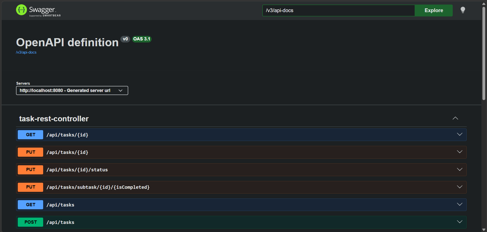


---

## 📊 JaCoCo Test Report

We use **JaCoCo** to measure **unit and integration test coverage** across the project.  
It provides detailed reports in both **HTML** and **XML** formats.

### ▶️ Generate Report
Run the following Gradle commands from the project root:
Include jacocoTestReport at the end of command to generate test report.

```bash
# Clean, build, run tests and generate test report
./gradlew clean build jacocoTestReport

# Run tests and generate test report
./gradlew test jacocoTestReport
```

📂 Report Location

After execution, you can find the report at: `build/reports/jacoco/test/html/index.html`.
Open the file in your browser to explore detailed coverage (classes, methods, lines, branches).

### 📸 Screenshot
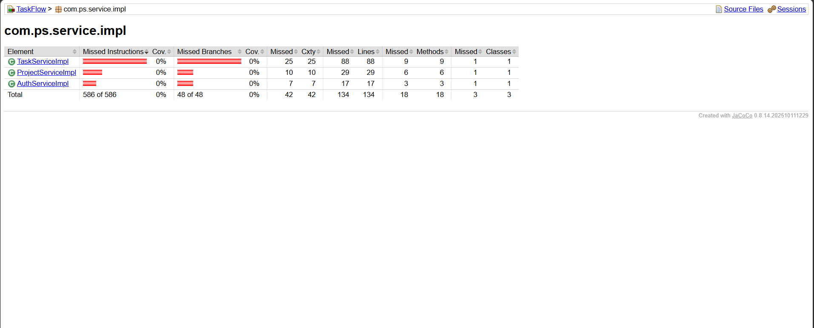


---

## 📸 Application Screenshots & Functionalities

---

### 🔐 Login Page (`index.html`)
- Secure login using **email & password**
- Validates user input before submission
- Stores JWT token in localStorage on success
- Redirects to dashboard after login

📸 Screenshot  


---

### 📝 Registration Page (`register.html`)
- New user registration with:
  - Name, Email, Password
- Client-side validation (password match, email format)
- Redirects to login after successful registration

📸 Screenshot  
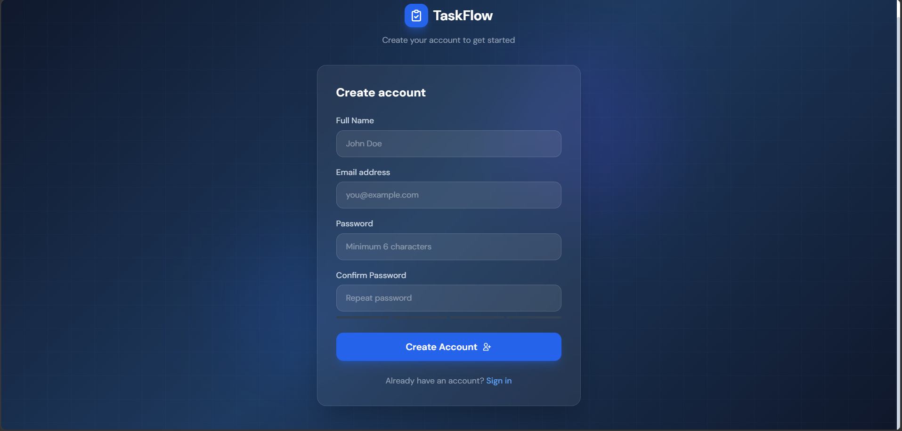

---

### 📊 Dashboard (`dashboard.html`)
- Displays key insights:
  - 📁 Total projects
  - 📌 Assigned tasks
  - ⏰ Tasks due today
- Shows **recent activity summary**
- Acts as the central overview page

📸 Screenshot  
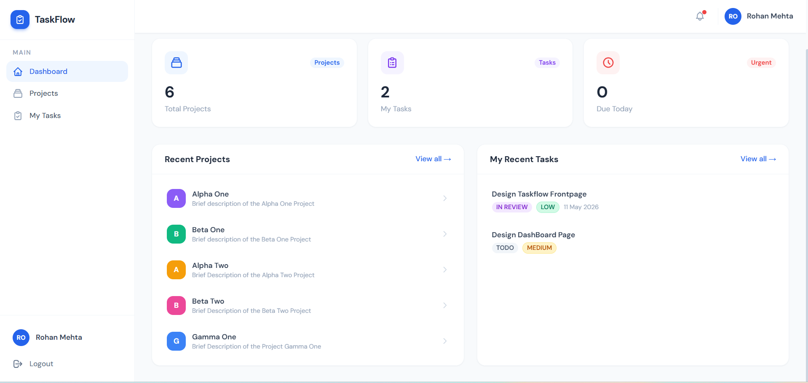

---

### 📁 Project Management (`projects.html`)
- View all projects in a **card-based grid layout**
- 🔍 Search projects easily
- ➕ Create new project using modal popup

#### ➕ Create Project Modal
- Input fields:
  - Project Name
  - Description
- Creates project via API call

📸 Screenshot  
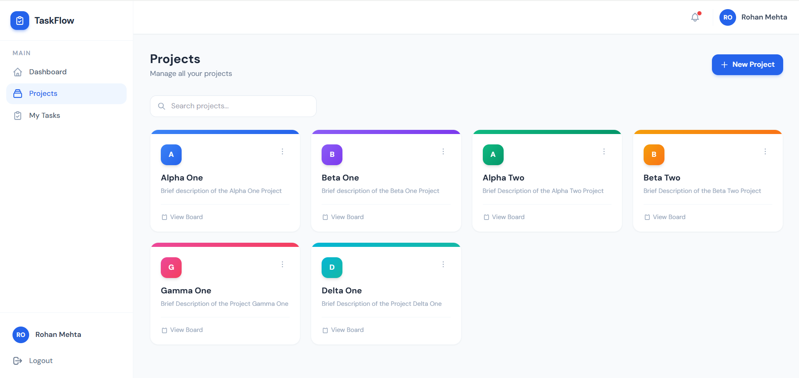
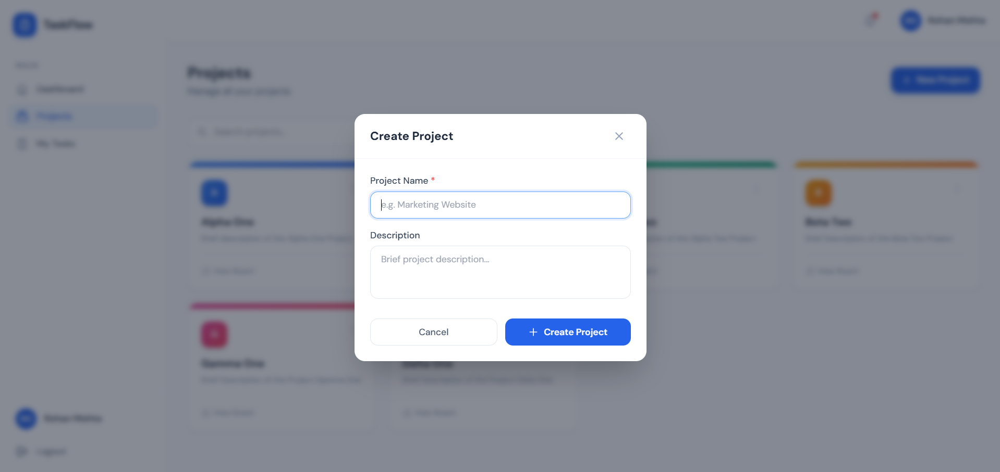

---

### 📌 Kanban Board (`board.html`)
- Visual task management using **Kanban board**
- Tasks categorized into:
  - 🟡 TODO
  - 🔵 IN PROGRESS
  - 🟣 IN REVIEW
  - 🟢 DONE
- Drag-and-drop tasks across columns
- Filter tasks by user, priority, etc.

📸 Screenshot  
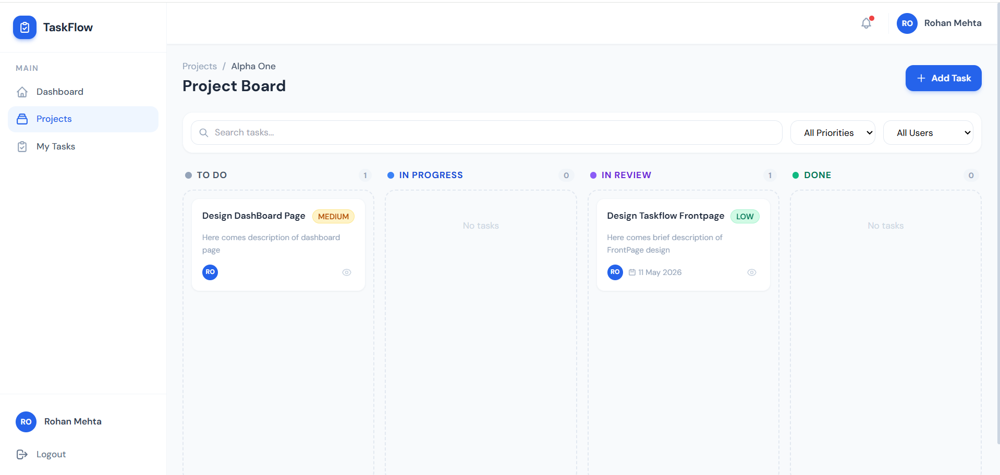

---

### 🧾 Task Detail Modal (from Board)
- Opens when clicking a task card
- Displays:
  - Task title & description
  - Assigned user
  - Priority & due date

#### 🔧 Features:
- ✅ Manage **subtasks (checklist)**
  - Add new subtask
  - Mark as complete/incomplete
- 💬 Add & view **comments**
- ✏️ Edit task (opens another modal)

📸 Screenshot  
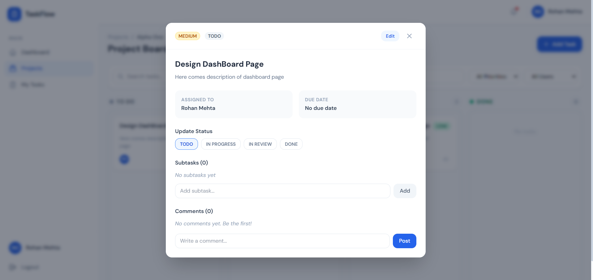

---

### ✏️ Edit Task Modal
- Update:
  - Title
  - Description
  - Priority
  - Assigned user
  - Due date
- Saves updated task via API

📸 Screenshot  
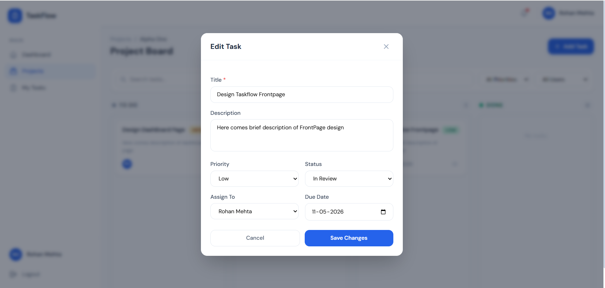

---

### 📋 My Tasks Page (`tasks.html`)
- Displays all assigned tasks in **list format**
- Supports:
  - 🔍 Filtering (status, priority, due date)
  - 📄 Pagination for large data
- Click on task → opens task detail modal

📸 Screenshot  
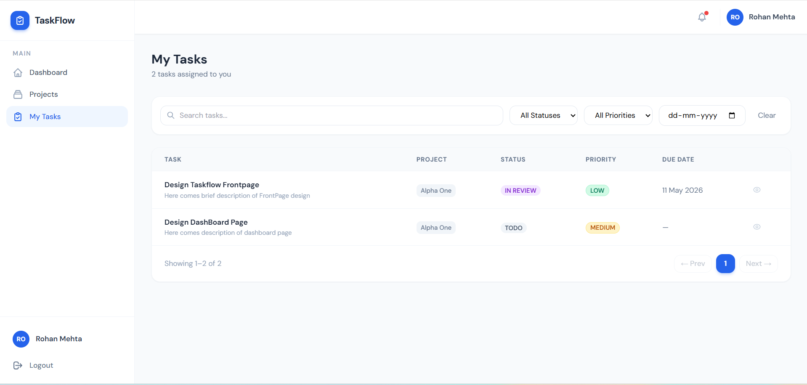

---

### 🧾 Task Detail Modal (from My Tasks)
- Same as board modal with:
  - Task details
  - Comments section
- ➡️ Button to navigate to **Kanban Board view**

📸 Screenshot  
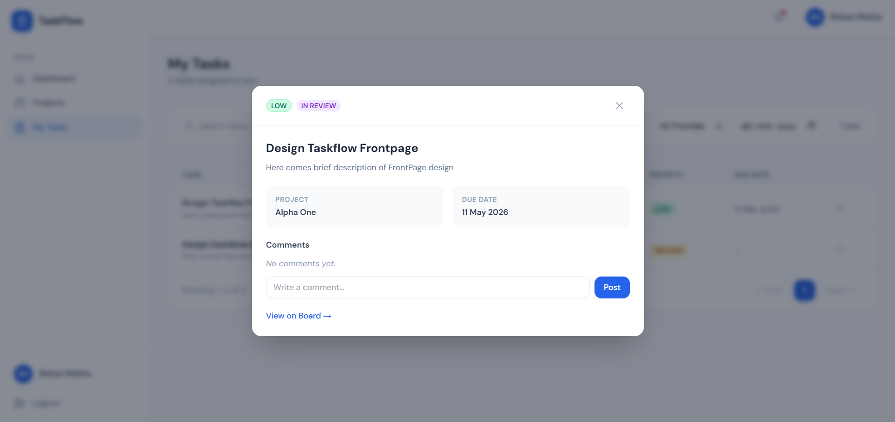

---